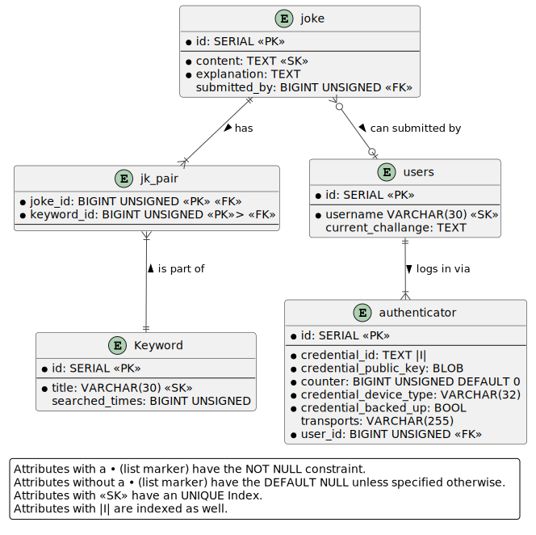

# Bavarian Joke Generator
## A. Introduction
This little university project represents a "Joke Generator" in the form of a Website.
These Jokes are written in the bavarian dialect of Bavaria in southern Germany.
The Joke Generation basically just takes in a keyword from a user in english and
displays all jokes accociated with this keywordto the user.
Additionally users can also submit their own jokes given
    - the content of the joke in German or Bavarian,
    - the explanation of this joke in English and
    - the keywords that should be associated with this joke.
    - Optionally the user can submit their joke with their username by authenticating

These are the most basic features and use cases this website is supposed to provide.
In the future and further down in this document you will see some extra features like managing your submittet jokes after logging in. These are not **implemented yet**.

The website can currently be accessed on [http://bavarian-joke-generator.org](http://bavarian-joke-generator.org) (*might change*)

**The https connection does no work and therefore webauthn is broken on this live version**
## B. Documentation
- [Jump to local setup guide](#i-development-setup)
### a) Technologies used:
- **Setup & Deplyment**: PNPM + Docker
- **User Interface(Front End):** Plain HTML, CSS and JavaScript
    - **Authentication:** simplewebauthn
- **Webserver**: NGINX
- **Services**:
    - **Server Side Rendering**: Node.js + express.js
    - **Authentication**: Node.js + express.js + simplewebauthn
- **Database**: MySQL via myql2 Node.js client

### b) Database Models
#### i. Implemented Use Cases: 
- A user can search for *any* Bavarian jokes by submitting *one* English keyword
- A user can submit a Bavarian joke alongside _at least one_, related keyword
- A Bavarian joke is accompanied by its required explanation in English
- A user can submit a joke anonymously without logging in
    - These jokes can not be edited afterwards by them
- A user can sign up & log in  via webauthn (without a password)
    - webauthn needs one current challange for a user to be solved by on of the users registered authenticators (i.e. private key)
- Authenticating/Logging in is possible via submitting a joke

#### ii. Use Cases to be implemented: 
- A user can log in to submit jokes and view, edit & delete their submissions
    - On joke deletion, the joke-keyword pair gets deleted as well
    - Changing the assoiated keyword adds a new keyword if it does not exist yet and associates the joke with the new keyword(s)
- A loggeed in user can register _multiple_ webauthn authenticators (e.g. Phone, Yubikey, etc.)
- A logged in user can change their username, if the new one does not exist yet
- A user can search for a Joke by a fuzzy/full-text-search
- Jokes that already exist should not be submittable
- Jokes that are too similar should also not be submittable
- A user is shown an existing keyword dropdown of most searched keywords, when searching via keyword
- An Admin can delete keywords, on which the associated joke-keyword pairs get deleted
    - If any joke ends up with no joke-keyword pairs through this, it should still be requestable by the "Other"-keyword
- An Admin can edit keywords

#### iii. Conceptual Model
The heart of this project are primarily the Jokes and the pair they build with their keywords, which is reflected in the relations between them in the following diagram


If you are unfamiliar with its crow foot notation, [this image can help you](https://www.codeproject.com/KB/architecture/878359/extracted-png-image1.png).

#### iiii. Physical Model
This next diagram shows the real implementation of this project's relational database with MySQL,
Be aware that this **only** includes features from the [included features](#i.-implemented-use-cases%3A).
Any use case still to be implemented is not necessarily yet possible with this design.


### c) Contributing
ALthough this is a private and small university project, everyone is free to fork this repository, submit pull request and report issues.

#### i. Development Setup
To run this website (webserver) on your local machine:
1. Make sure you can run [docker-compose](https://docs.docker.com/get-docker/) (*on Mac and Windows you will have to start Docker Desktop first*)
2. [PNPM](https://pnpm.io/installation) is installed on your system
3. Run the following commands in your projects folder:
```bash
pnpm install
pnpm docker-dev
# or
pnpm docker-test #before running any tests
```
-> The website is now visitable on [localhost/](http://localhost/)
